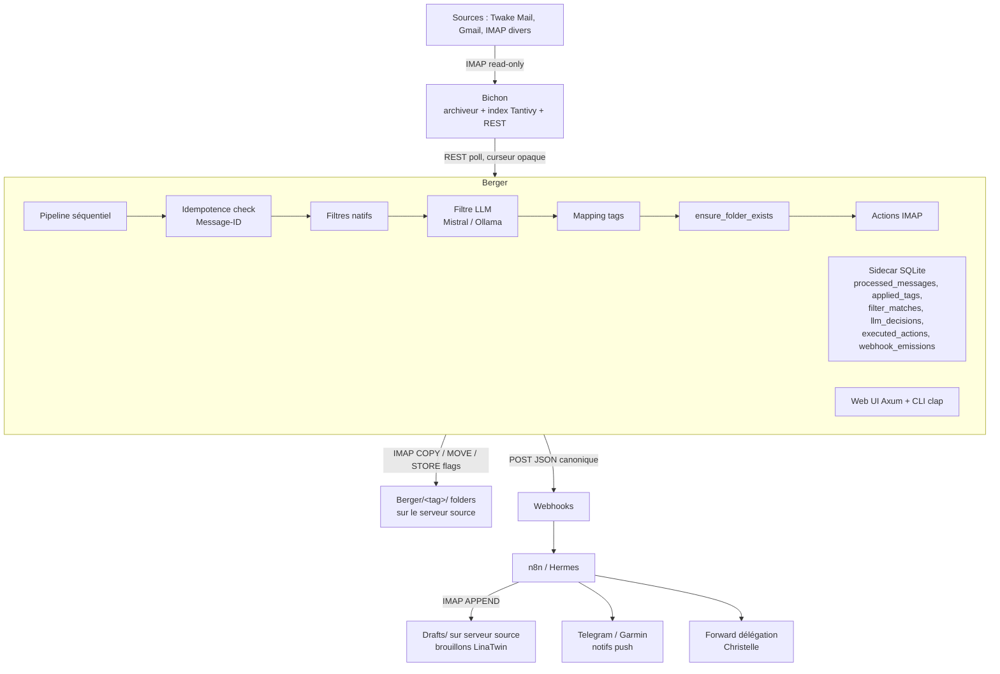

# PRD — Berger v1.0

| | |
|---|---|
| **Projet** | Berger |
| **Repo** | `github.com/mmaudet/berger` |
| **Version produit** | 1.0 (MVP) |
| **Révision document** | 3 — 19 mai 2026 |
| **Statut** | Validé, prêt pour implémentation |
| **Auteur** | Michel-Marie Maudet |
| **Licence** | AGPLv3 |
| **Durée cible** | 2 semaines (sprint dense) |

**Changelog révisions :**
- *Rév. 1 (18 mai 2026)* : version initiale validée.
- *Rév. 2 (19 mai 2026)* : ajout section 5.5 "Actions par tag" (5 primitives IMAP), section 5.6 "Webhooks" enrichie avec contrat de payload et 3 cas d'usage canoniques, ajustement architecture (flux retour Drafts via webhook).
- *Rév. 3 (19 mai 2026)* : ajout section 5.9 "Schéma de persistance" (schéma SQLite détaillé, rétention, backup), section 5.10 "Cohérence Bichon ↔ Berger" (règles dures contre bouclage, eventual consistency), section 5.11 "Résilience aux modifications utilisateur" (suppression de dossiers Berger, renommage, déplacement manuel). Risques et critères d'acceptation enrichis.

---

## 1. Pitch

Berger est un démon de triage email open-source en Rust qui s'appuie sur Bichon comme backbone d'archivage. Pipeline déclaratif YAML, filtres natifs + LLM (Mistral / Ollama), writeback IMAP en folders pour rester compatible avec tous les clients mail. Émet des événements webhooks pour déléguer aux générateurs externes (LinaTwin, n8n, Hermes) tout ce qui sort du strict tri.

## 2. Contexte

L'inbox moderne est saturée. Les solutions existantes sont soit anciennes et techniques (afew/notmuch en Python), soit propriétaires et enfermées dans Gmail/MS Graph (Fyxer, Cora, Superhuman, Shortwave). Aucune ne combine : open-source, AGPL, souverain, agnostique du serveur mail, agnostique du client, LLM pluggable. Berger comble ce trou en se positionnant comme l'**afew de 2026**.

## 3. Utilisateur cible v1

Michel-Marie Maudet, un seul utilisateur. Cas d'usage : ~150–250 mails/jour répartis sur Twake Mail LINAGORA + Gmail perso + comptes secondaires. Volonté : retrouver un inbox-zero quotidien sans renoncer à la souveraineté ni à l'open-source.

## 4. Critère de succès

**Berger tourne 30 jours consécutifs sur les mails réels de l'auteur sans être désinstallé.**

Critère unique, binaire, non-négociable. Tous les autres indicateurs (stars GitHub, démo POSAIS, retours communauté) sont secondaires.

## 5. Scope MVP

### 5.1 Ingestion

- Lecture exclusive via Bichon REST API (pas d'IMAP direct depuis Berger pour la lecture)
- Multi-comptes (≥ 2 configurables dans le YAML)
- Polling périodique avec **curseur Bichon opaque** persisté en SQLite (pas l'UID IMAP, qui est instable)
- Idempotence stricte : un Message-ID traité une fois, jamais retraité — y compris si Bichon re-sert le même mail depuis un autre dossier
- Filtrage en lecture : tout mail dont le dossier source commence par `Berger/` est **ignoré silencieusement** (cf. § 5.10)

### 5.2 Filtres natifs (sans LLM)

Au minimum 4 types, déclaratifs dans le YAML :

- `list_unsubscribe` (présence du header)
- `sender_in` (liste CSV de domaines/adresses)
- `subject_regex` (patterns courants : factures, notifs)
- `header_match` (X-Spam, Auto-Submitted, Precedence:bulk, etc.)

Bonus si temps disponible : `domain_classify` et `thread_inherit`.

### 5.3 Filtre LLM

- Client OpenAI-compatible HTTP (cible : Mistral API + Ollama, interchangeables via YAML)
- Schéma JSON typé en sortie, déclaré dans le YAML (champs : `category`, `needs_reply`, `priority`, extensibles)
- Cache `Message-ID + hash(prompt)` → pas de réinvocation
- Modèles validés au MVP : **Mistral Small 3** (API) et **gemma3:12b** (Ollama local)
- Failover : si LLM échoue, le mail passe avec un tag `llm_error` au lieu de bloquer

### 5.4 Mapping classification → tags

- Templating `cat/{category}`, conditions `if priority >= 4`
- Composition de tags hiérarchiques (`cat/work`, `cat/perso`)
- Les tags sont persistés dans le sidecar SQLite (source de vérité)
- Header `X-Berger-Tags` stocké dans le sidecar pour audit et export Thunderbird (jamais injecté dans le mail RFC822)

### 5.5 Actions par tag

C'est l'étage qui matérialise le tri pour l'utilisateur. Berger applique des **actions IMAP atomiques**, déclarées par tag dans le YAML. Cinq primitives, pas plus.

#### Primitives disponibles

| Primitive | Effet IMAP | Réversible | Remarques |
|---|---|---|---|
| `copy_to: <folder>` | `IMAP COPY` vers `Berger/<folder>/` | ✅ Le mail reste partout | Action par défaut, non destructive |
| `move_to: <folder>` | `COPY` puis `STORE +FLAGS \Deleted` puis `EXPUNGE` | ⚠️ Difficile (UID change) | Vide la INBOX, à utiliser sur les bulks |
| `mark_seen: true` | `STORE +FLAGS \Seen` | ✅ Toggle simple | Rend le mail silencieux (pas compté en non-lu) |
| `mark_flagged: true` | `STORE +FLAGS \Flagged` | ✅ Toggle simple | Étoile/drapeau visible dans tous les clients |
| `webhook: <name>` | POST HTTP vers endpoint nommé | N/A | Délègue toute action complexe en aval |

**Hors scope v1.0 :** suppression définitive (`delete: true`), forward natif, génération de réponses, modification de contenu mail.

#### Sémantique d'exécution

1. Les tags sont calculés (filtres natifs puis LLM)
2. Pour chaque tag actif, Berger collecte les actions déclarées
3. Avant chaque `copy_to` / `move_to`, Berger vérifie l'existence du dossier cible et **le recrée s'il a été supprimé** (cf. § 5.11)
4. Les actions IMAP sont **consolidées** : si plusieurs tags appellent `copy_to`, plusieurs COPY ; si conflit `move_to` vs `copy_to`, `move_to` gagne (cas explicite à logger en WARN)
5. Les webhooks sont **émis en parallèle**, fire-and-forget avec retry exponentiel
6. L'ordre dans le YAML n'est pas sémantique — les actions sont commutatives par design

#### Exemple complet de politique YAML

```yaml
actions:
  newsletter:
    move_to: "newsletters"
    mark_seen: true
    
  notif/github:
    move_to: "notifs/github"
    mark_seen: true
    
  notif/linkedin:
    move_to: "notifs/linkedin"
    mark_seen: true
    
  cat/urgent:
    copy_to: "urgent"
    mark_flagged: true
    webhook: hermes-push-urgent
    
  cat/work:
    copy_to: "cat/work"
    
  clients/OSSA:
    copy_to: "clients/OSSA"
    
  delegate/christelle:
    copy_to: "delegate/christelle"
    webhook: hermes-forward-christelle
    
  a-repondre/pro:
    copy_to: "a-repondre/pro"
    mark_flagged: true
    webhook: linatwin-draft
    
  spam-confirme:
    move_to: "junk"
    mark_seen: true
    # delete: NON, hors scope MVP
```

#### Garanties

- **Non destructif par défaut** : si une action n'est pas explicitement déclarée pour un tag, Berger se contente de logger l'application du tag dans SQLite et n'altère pas le mail sur le serveur.
- **COPY plutôt que MOVE** : le défaut est `copy_to`. `move_to` doit être explicitement choisi par l'utilisateur, tag par tag.
- **Pas d'EXPUNGE global** : la suppression est réservée à `move_to` et limitée au mail concerné (UID).

### 5.6 Webhooks

Les webhooks sont la **passerelle vers les actions complexes** (génération de brouillons, forward, notifs push, création de tâches). Berger émet un événement structuré, le consommateur (n8n, Hermes, LinaTwin, MCP) décide quoi en faire.

#### Configuration YAML

```yaml
webhooks:
  - name: linatwin-draft
    url: "https://hermes.linagora.io/webhook/linatwin/draft"
    method: POST
    headers:
      Authorization: "Bearer ${HERMES_TOKEN}"
    retry:
      max_attempts: 3
      backoff: exponential
      
  - name: hermes-push-urgent
    url: "https://hermes.linagora.io/webhook/push/urgent"
    method: POST
    
  - name: hermes-forward-christelle
    url: "https://n8n.linagora.io/webhook/berger/delegate"
    method: POST
```

#### Contrat de payload (canonique)

Tous les webhooks reçoivent le **même schéma** par défaut. Le consommateur route selon les tags. Le payload est templatisable via Handlebars si l'utilisateur veut un format custom par webhook.

**Payload canonique :**

```json
{
  "event": "berger.tag_applied",
  "berger_version": "0.1.0",
  "timestamp": "2026-05-19T08:32:15Z",
  "account": "michel-marie@linagora.com",
  "tags": ["a-repondre/pro", "cat/urgent"],
  "filters_matched": ["sender_in:gouv-interieur", "llm:cat=work"],
  "message": {
    "id": "<abc-def@interieur.gouv.fr>",
    "thread_id": "thread-xyz",
    "from": {
      "name": "Arnaud Clair",
      "email": "arnaud.clair@interieur.gouv.fr"
    },
    "to": [
      {"name": "Michel-Marie Maudet", "email": "michel-marie@linagora.com"}
    ],
    "cc": [],
    "subject": "Validation architecture Zero Trust RAG",
    "date": "2026-05-19T08:28:00Z",
    "body_text": "Bonjour Michel-Marie, ...",
    "body_html": "<p>Bonjour Michel-Marie, ...</p>",
    "has_attachments": false
  },
  "classification": {
    "category": "work",
    "needs_reply": true,
    "priority": 5,
    "language": "fr",
    "sentiment": "neutral"
  },
  "bichon_message_uri": "https://bichon.linagora.io/api/v1/messages/abc-def"
}
```

#### Trois cas d'usage canoniques (contrat avec n8n/Hermes)

**Cas 1 — Génération de brouillon (`linatwin-draft`)**

- Berger émet le payload canonique avec `tags: ["a-repondre/pro"]` et `classification.needs_reply: true`
- n8n reçoit, appelle LinaTwin (Mistral/Claude) avec le contexte mail + l'historique du thread
- LinaTwin génère une réponse en français dans le style de l'utilisateur
- n8n fait **IMAP APPEND vers le dossier `Drafts`** du compte source avec le brouillon
- Résultat utilisateur : un brouillon apparaît dans `Brouillons` de Twake Mail, prêt à relire et envoyer

**Cas 2 — Forward délégation (`hermes-forward-christelle`)**

- Berger émet le payload avec `tags: ["delegate/christelle"]`
- n8n reçoit, déclenche un workflow :
  - Envoi notif Telegram à Christelle avec lien Bichon vers le mail
  - Ou envoi email récapitulatif quotidien (digest 18h)
- Résultat utilisateur : Christelle est tenue informée sans que Michel-Marie n'ait à forwarder manuellement

**Cas 3 — Notif push urgent (`hermes-push-urgent`)**

- Berger émet le payload avec `tags: ["cat/urgent"]` et `priority >= 4`
- Hermes reçoit, route vers les canaux configurés :
  - Telegram bot personnel
  - Apple Watch / Garmin Venu 4 via API
- Résultat utilisateur : notif courte avec From + Subject + résumé 1-ligne (si fourni par LinaTwin)

#### Garanties

- **Fire-and-forget** : Berger ne bloque pas en attendant la réponse webhook
- **Retry borné** : 3 tentatives avec backoff exponentiel (1s, 4s, 16s), puis abandon avec log ERROR
- **Pas de queue persistante** : si Berger crashe entre l'émission et le succès, l'événement est perdu (acceptable au MVP — c'est du best-effort, pas du transactionnel)
- **Tags filtrables** : un webhook peut déclarer `when: ["cat/urgent"]` pour ne se déclencher que sur certains tags

### 5.7 Interface

**CLI** (`clap`) : `run`, `explain <msg-id>`, `status`, `dry-run`, `export-thunderbird`

**Web UI** : port 7000, servie par le même binary, Axum + Askama + Tailwind. **Sobre mais soignée** — palette neutre type Linear/Vercel, pas de Bootstrap brut. 4 pages :

- `/` : stats (mails traités 24h/7j, tokens LLM, coût estimé, taux de hit cache, webhooks émis/échoués)
- `/recent` : 50 derniers mails traités avec tags appliqués + actions exécutées + filtres déclencheurs
- `/explain/<id>` : pour un mail donné, prompt envoyé + sortie LLM brute + chain de filtres + actions appliquées + webhooks émis
- `/config` : visualisation du YAML actuel (lecture seule au MVP)

### 5.8 Ops

- Single binary Rust, image Docker
- Config YAML chargée au démarrage uniquement (pas de SIGHUP au MVP)
- Logs JSON structurés (stdout)
- Sidecar SQLite (un fichier `berger.db`)
- systemd unit + docker-compose fournis

### 5.9 Schéma de persistance

Tout l'état Berger vit dans le sidecar SQLite (`berger.db`), seule source de vérité côté Berger.

#### Schéma

```sql
-- Comptes mail synchronisés via Bichon
CREATE TABLE accounts (
    id INTEGER PRIMARY KEY,
    name TEXT NOT NULL UNIQUE,
    bichon_account_id TEXT NOT NULL,
    last_cursor TEXT,             -- curseur opaque Bichon
    last_polled_at TIMESTAMP,
    created_at TIMESTAMP DEFAULT CURRENT_TIMESTAMP
);

-- Un mail traité = une ligne. Source de vérité de l'idempotence.
CREATE TABLE processed_messages (
    message_id TEXT PRIMARY KEY,  -- RFC 822 Message-ID
    account_id INTEGER REFERENCES accounts(id),
    bichon_uri TEXT,              -- pointeur vers la copie Bichon
    subject TEXT,
    from_email TEXT,
    from_name TEXT,
    date TIMESTAMP,
    processed_at TIMESTAMP NOT NULL,
    berger_version TEXT NOT NULL, -- 0.1.0
    config_hash TEXT NOT NULL     -- hash du YAML utilisé
);
CREATE INDEX idx_processed_account_date ON processed_messages(account_id, date);

-- Tags appliqués (1 mail → N tags)
CREATE TABLE applied_tags (
    message_id TEXT REFERENCES processed_messages(message_id),
    tag TEXT NOT NULL,
    applied_at TIMESTAMP NOT NULL,
    PRIMARY KEY (message_id, tag)
);
CREATE INDEX idx_tags_tag ON applied_tags(tag);

-- Filtres déclencheurs (traçabilité : pourquoi ce tag ?)
CREATE TABLE filter_matches (
    id INTEGER PRIMARY KEY,
    message_id TEXT REFERENCES processed_messages(message_id),
    filter_type TEXT NOT NULL,    -- list_unsubscribe | sender_in | llm | ...
    filter_name TEXT NOT NULL,    -- nom dans le YAML
    details_json TEXT             -- ce qui a matché précisément
);

-- Décisions LLM (audit + cache + métriques coût)
CREATE TABLE llm_decisions (
    id INTEGER PRIMARY KEY,
    message_id TEXT REFERENCES processed_messages(message_id),
    model TEXT NOT NULL,          -- mistral-small-3, gemma3:12b...
    prompt_hash TEXT NOT NULL,    -- pour cache
    prompt_text TEXT NOT NULL,    -- audit complet
    response_json TEXT NOT NULL,
    tokens_input INTEGER,
    tokens_output INTEGER,
    latency_ms INTEGER,
    cost_usd REAL,
    called_at TIMESTAMP NOT NULL
);
CREATE INDEX idx_llm_cache ON llm_decisions(message_id, prompt_hash);

-- Actions IMAP exécutées
CREATE TABLE executed_actions (
    id INTEGER PRIMARY KEY,
    message_id TEXT REFERENCES processed_messages(message_id),
    action_type TEXT NOT NULL,    -- copy_to | move_to | mark_seen | mark_flagged
    target TEXT,                  -- folder destination si applicable
    imap_response TEXT,           -- pour debug
    succeeded BOOLEAN NOT NULL,
    error TEXT,
    executed_at TIMESTAMP NOT NULL
);

-- Webhooks émis
CREATE TABLE webhook_emissions (
    id INTEGER PRIMARY KEY,
    message_id TEXT REFERENCES processed_messages(message_id),
    webhook_name TEXT NOT NULL,
    payload_json TEXT NOT NULL,
    http_status INTEGER,
    attempts INTEGER NOT NULL,
    succeeded BOOLEAN NOT NULL,
    emitted_at TIMESTAMP NOT NULL,
    completed_at TIMESTAMP
);
```

#### Volumétrie & rétention

- Estimation : 250 mails/jour × ~5 rows d'actions = ~450k rows/an dans `executed_actions`. Base estimée à 200–500 MB après un an.
- **Aucune purge automatique au MVP.** L'historique est précieux pour itérer sur les prompts et débugger les faux positifs.
- À reconsidérer en v1.1 si la base dépasse 5 GB.

#### Backup

- Le binaire ne gère pas le backup au MVP.
- **Recommandation utilisateur** (à documenter dans `docs/ops.md`) : cron quotidien avec `sqlite3 berger.db ".backup berger-backup-$(date +%F).db"`, rétention 30j.
- Le backup peut être lancé sans arrêter Berger (SQLite WAL mode activé par défaut dans le code).

#### Inspection

- `berger explain <message-id>` reconstruit toute la chaîne de décision (filtres → LLM → tags → actions IMAP → webhooks), avec timestamps et erreurs s'il y en a.
- `berger status` affiche les compteurs globaux (mails traités, coût LLM cumulé, dossiers gérés).
- La WebUI `/explain/<id>` expose la même chose visuellement.

### 5.10 Cohérence Bichon ↔ Berger

Bichon est conçu pour des sources statiques côté serveur (il lit, il n'écrit jamais). Berger casse cette hypothèse en écrivant sur l'IMAP source. Cette section liste les règles dures pour éviter tout dérapage.

#### Cas par cas

| Action Berger | Effet IMAP source | Conséquence côté Bichon | Désync ? |
|---|---|---|---|
| `copy_to: cat-work` | Le mail existe dans INBOX **et** `Berger/cat-work/` | Au prochain cycle, Bichon indexe le nouveau dossier, le même Message-ID apparaît **deux fois** dans son index | ⚠️ Pollution d'index |
| `move_to: junk` | Le mail disparaît de INBOX, apparaît dans `Berger/junk/` | Au prochain cycle, Bichon voit l'EXPUNGE et la nouvelle entrée. Index cohérent mais latent | ⏱️ Eventual consistency |
| `mark_seen` / `mark_flagged` | `STORE +FLAGS` sur l'UID INBOX | Bichon détecte le changement via FETCH au sync incrémental | ✅ Pas de désync |

#### Trois règles dures (à coder dans le MVP, pas en option)

**Règle 1 — Berger ignore ses propres dossiers en lecture**

```rust
fn should_process(msg: &BichonMessage) -> bool {
    !msg.folder.starts_with("Berger/")
        && !msg.folder.starts_with("INBOX/Berger/")
}
```

Sans cette règle, Berger boucle sur ses propres COPYs au cycle suivant.

**Règle 2 — Idempotence stricte par Message-ID**

Avant tout traitement, Berger vérifie dans `processed_messages` :

```rust
if sidecar.is_already_processed(&msg.message_id) {
    return Ok(SkipReason::AlreadyProcessed);
}
```

Le Message-ID RFC 822 est stable à travers les COPY/MOVE. Cette vérification garantit qu'un mail n'est jamais traité deux fois, peu importe combien de fois Bichon le réindexe.

**Règle 3 — Recommandation Bichon (config externe, à documenter)**

Documenter dans `docs/bichon-setup.md` qu'il est **fortement recommandé** d'exclure `Berger/*` côté Bichon aussi :

```toml
[accounts.linagora]
imap_server = "imap.linagora.com"
excluded_folders = ["Berger/*", "Junk", "Trash"]
```

Cela ne change rien fonctionnellement (règle 1 protège déjà), mais ça évite à Bichon de gaspiller du disque et de l'index Tantivy.

#### Modèle de cohérence : eventual consistency assumée

Berger et Bichon ne sont **pas synchrones**. Quand Berger fait `move_to: junk` :

```
T+0s   : Berger fait COPY puis STORE \Deleted puis EXPUNGE
T+0s   : Le mail a disparu de INBOX, apparu dans Berger/junk/
T+0..N : Bichon ne sait pas encore. Son index dit toujours "INBOX"
T+N s  : Bichon poll incrémental, met à jour son index
```

Où N est le poll interval Bichon (typiquement 30s à 5 min). À documenter explicitement dans le README : *"Berger et Bichon sont en cohérence à terme. Comptez 1 à 5 minutes de latence entre une action Berger et la mise à jour de l'index Bichon."*

### 5.11 Résilience aux modifications utilisateur

L'utilisateur est libre de modifier ses dossiers IMAP comme il veut, à tout moment, sans prévenir Berger. Le démon doit accepter cette réalité sans crasher ni corrompre son état. **Principe directeur : respect de la volonté utilisateur**, jamais de "remise en ordre" autoritaire.

#### Cas à gérer

| Action utilisateur dans Twake Mail / Apple Mail / Thunderbird | Comportement Berger attendu |
|---|---|
| **Suppression d'un dossier `Berger/newsletters/`** | Au prochain `copy_to: newsletters` (ou `move_to: newsletters`), Berger détecte que le dossier n'existe pas, **le recrée silencieusement** et y poste le mail. Log au niveau **WARN** : `"folder Berger/newsletters was missing, recreated"`. Les rows historiques dans `applied_tags` et `executed_actions` restent intactes — l'audit garde la trace que Berger avait posé X mails à T-Y, même si l'utilisateur les a tous supprimés depuis. |
| **Suppression d'un mail individuel** dans `Berger/cat-work/` | Berger ne le détecte pas et ne réagit pas. Le mail original en INBOX est intact (cas `copy_to`) ou perdu (cas `move_to`). L'audit SQLite reste inchangé. |
| **Renommage d'un dossier** `Berger/newsletters/` → `Mes-Newsletters/` | Berger ne voit pas le renommage. Au prochain tag `newsletter`, il recrée `Berger/newsletters/`. L'utilisateur se retrouve avec deux dossiers. Pas idéal mais non-bloquant. Documenté comme limitation MVP. |
| **Déplacement manuel** d'un mail de `Berger/cat-work/` vers `Berger/clients/OSSA/` | Berger ne le détecte pas. SQLite garde le tag `cat/work` mais la réalité IMAP a changé. Drift documenté, à réconcilier en v1.1. |
| **Suppression de tous les dossiers `Berger/*`** ("reset") | Berger les recrée au fur et à mesure des nouveaux mails traités. SQLite reste intact. Pour un reset complet, l'utilisateur doit aussi supprimer `berger.db`. Documenté. |

#### Implémentation : helper `ensure_folder_exists`

Avant chaque `copy_to` ou `move_to`, Berger appelle :

```rust
async fn ensure_folder_exists(
    imap: &mut ImapSession,
    folder: &str
) -> Result<(), ImapError> {
    // 1. LIST pour vérifier l'existence
    if !imap.folder_exists(folder).await? {
        tracing::warn!(
            folder = %folder,
            "folder was missing, recreating (likely user-deleted)"
        );
        imap.create(folder).await?;
        imap.subscribe(folder).await?;  // visible dans le client mail
    }
    Ok(())
}
```

Cette vérification est lazy (à chaque action, pas en pré-flight global) pour ne pas alourdir le polling.

#### Risque résiduel : MOVE + dossier supprimé

C'est le seul cas vraiment dangereux : si un mail a été MOVED dans `Berger/junk/` (donc plus présent ailleurs) et que l'utilisateur supprime le dossier, **le mail est définitivement perdu**. Berger ne peut pas restaurer.

**Mitigations** :

- Le défaut MVP pour les tags critiques (`spam-confirme`) reste à débattre : MOVE est satisfaisant pour de la newsletter mais risqué pour autre chose.
- Recommandation utilisateur dans le README : *"Pour les dossiers contenant des `move_to`, gardez une corbeille IMAP serveur avec rétention 30 jours, et ne purgez pas manuellement sans précaution."*
- Sur Twake Mail / Apache James, la corbeille est par défaut configurée avec rétention serveur.

#### Recommandations utilisateur (à documenter dans le README)

- **Pour purger les newsletters/notifs** : utiliser la corbeille du client mail (qui purge automatiquement après X jours côté serveur IMAP), pas la suppression définitive.
- **Pour réinitialiser proprement Berger** : supprimer le fichier `berger.db` ET tous les dossiers `Berger/*` côté serveur.
- **Pour réorganiser les dossiers Berger** : modifier le YAML, pas l'arborescence côté client mail. Berger n'a pas de mécanisme de renommage suiveur en v1.

#### Commandes CLI v1.1 prévues (pas dans le MVP)

- `berger reconcile` : pour chaque tag dans SQLite, vérifie que le mail est bien dans le dossier IMAP attendu. Rapport JSON.
- `berger health` : check existence de tous les dossiers cibles déclarés dans le YAML.
- `berger rebuild-folders` : recrée tous les dossiers Berger manquants (structure vide, sans réindexer).

## 6. Non-scope (explicite)

- ❌ Backfill historique
- ❌ Feedback loop / correction utilisateur / online learning
- ❌ JMAP keywords writeback (repoussé v1.1)
- ❌ Multi-utilisateur, ABAC, identité
- ❌ Recherche intégrée (déléguée à Bichon)
- ❌ Plugins WASM / Lua
- ❌ Modification destructive du contenu mail (APPEND/EXPUNGE pour réécrire)
- ❌ Connecteurs IMAP/JMAP directs en lecture (tout passe par Bichon)
- ❌ Édition YAML via WebUI (lecture seule)
- ❌ Reload config à chaud
- ❌ A/B testing prompts (CLI seulement, sans UI)
- ❌ Génération de réponses dans Berger lui-même (délégué aux webhooks → LinaTwin/Hermes)
- ❌ Forward / envoi de mail depuis Berger (délégué aux webhooks)
- ❌ Suppression définitive (`EXPUNGE` standalone) — seul `move_to` peut expunger l'original après COPY
- ❌ Queue persistante pour les webhooks (best-effort uniquement)
- ❌ **Réconciliation automatique des drifts utilisateur** (`berger reconcile`, `berger rebuild-folders`) — repoussé v1.1
- ❌ **Détection de renommage de dossier Berger** — limitation MVP documentée
- ❌ **Purge automatique du sidecar SQLite** — manuel uniquement au MVP

## 7. Architecture



## 8. Stack technique

| Couche | Choix |
|---|---|
| Langage | Rust stable, édition 2024 |
| Runtime async | Tokio |
| HTTP server (WebUI) | Axum |
| HTTP client (Bichon, LLM, webhooks) | reqwest |
| IMAP client (writeback folders + actions) | async-imap |
| Templating | Askama (HTML), Handlebars (webhooks) |
| CLI | clap v4 |
| Config | serde-yaml + validation custom |
| DB | rusqlite + refinery (migrations), WAL mode |
| Frontend CSS | Tailwind via CLI standalone |
| Logs | tracing + tracing-subscriber JSON |
| LLM | OpenAI-compatible HTTP (Mistral + Ollama) |
| Tests | cargo test + compte IMAP de dev (Greenmail) |
| CI | GitHub Actions (build + test + clippy) |
| Licence | AGPLv3 |
| Packaging | cargo build --release + Dockerfile multi-stage |

## 9. Jalons de livraison — sprint 2 semaines

### Semaine 1 — fondations

| Jour | Livrable |
|---|---|
| J1 | Init repo `mmaudet/berger`, AGPLv3 LICENSE, README v0, Cargo.toml, structure modules, GitHub Action CI, commit public initial |
| J2 | Client Bichon REST async + curseur opaque + filtrage `Berger/*` en lecture |
| J3 | Sidecar SQLite (les 7 tables du § 5.9, migrations refinery, repository pattern, WAL mode) |
| J4 | Config YAML + validation + chargement multi-comptes |
| J5 | 4 filtres natifs implémentés + tests unitaires |
| J6 | Moteur d'actions IMAP (COPY, MOVE, mark_seen, mark_flagged) + `ensure_folder_exists` + tests d'intégration |
| J7 | Premier tour de boucle complet sans LLM sur compte Twake Mail réel (filtres natifs + actions + idempotence) |

### Semaine 2 — intelligence & expérience

| Jour | Livrable |
|---|---|
| J8 | Client LLM OpenAI-compatible + intégration Mistral Small 3 |
| J9 | Pipeline LLM filter + schéma JSON typé + cache + intégration Ollama gemma3:12b |
| J10 | Webhooks POST (Handlebars template, retry, payload canonique) |
| J11 | WebUI Axum + 4 pages + Tailwind sobre |
| J12 | CLI complète (run, explain, status, dry-run, export-thunderbird) + tests |
| J13 | Doc README complète + `docs/yaml.md` + `docs/webhooks.md` + `docs/bichon-setup.md` + `docs/ops.md` + `berger.example.yaml` + Dockerfile + docker-compose + script export Thunderbird |
| J14 | Release v0.1.0 publique, annonce, démarrage du run de 30 jours |

## 10. Critères d'acceptation v1.0

- [ ] Au moins 2 comptes mail configurés et synchronisés via Bichon
- [ ] Les 4 filtres natifs documentés avec exemples YAML
- [ ] Le filtre LLM fonctionne avec Mistral Small 3 ET gemma3:12b sans modification de code
- [ ] Les 5 primitives d'actions (`copy_to`, `move_to`, `mark_seen`, `mark_flagged`, `webhook`) implémentées et testées
- [ ] Au moins 1 tag avec `move_to` testé sur compte réel (newsletters disparaissent de INBOX)
- [ ] Au moins 1 tag avec `mark_flagged` testé (drapeau visible dans Apple Mail iOS)
- [ ] Au moins 1 webhook POST déclenchable, testé sur n8n, avec payload canonique conforme
- [ ] Au moins 1 cas d'usage canonique opérationnel bout-en-bout : webhook `linatwin-draft` → n8n → APPEND IMAP Drafts → brouillon visible dans Twake Mail
- [ ] Writeback folders : `Berger/<tag>/` créés et peuplés sur le compte Twake Mail
- [ ] Mails visibles avec les bons folders dans Twake Mail web ET Apple Mail iOS
- [ ] WebUI accessible à `:7000`, 4 pages fonctionnelles, design soigné
- [ ] CLI `berger explain <msg-id>` retourne la trace complète d'une décision (tags, actions appliquées, webhooks émis)
- [ ] Script `berger export-thunderbird-filters` génère un `msgFilterRules.dat` importable
- [ ] **Sidecar SQLite** : les 7 tables du § 5.9 créées, migrations refinery jouées au démarrage, WAL mode activé
- [ ] **Idempotence** : test d'intégration qui re-soumet le même Message-ID 3 fois, vérifie que les actions IMAP ne sont exécutées qu'une fois
- [ ] **Filtrage `Berger/*` en lecture** : test d'intégration qui prouve qu'un mail dans `Berger/cat-work/` n'est jamais re-traité
- [ ] **`ensure_folder_exists`** : test d'intégration qui supprime manuellement un dossier `Berger/foo`, déclenche une action `copy_to: foo`, vérifie que le dossier est recréé et le mail posté
- [ ] README, doc YAML, doc webhooks, doc Bichon setup, doc ops disponibles dans le repo public
- [ ] Le démon tourne 30 jours sans crash sur le mail de l'auteur (= critère de succès)

## 11. Risques & mitigations

| Risque | Probabilité | Impact | Mitigation |
|---|---|---|---|
| Bus factor Bichon (mono-contributeur, modèle commercial possible) | Moyen | Haut | Fork défensif `mmaudet/bichon` dès J1. Architecture Berger isolée derrière un trait `MessageSource`. |
| Budget tokens LLM dérape | Moyen | Moyen | Filtres natifs court-circuitent le LLM. Cache Message-ID. Limite quotidienne configurable. |
| IMAP MOVE casse les threads sur certains clients | Moyen | Haut | `move_to` opt-in, jamais par défaut. Tests sur Twake Mail + Apple Mail + Gmail web. Documentation dans `docs/yaml.md`. |
| Webhooks LinaTwin/Hermes down → brouillons non générés | Moyen | Faible | Best-effort assumé. Tags appliqués quand même. `berger replay-webhook` en v1.1. |
| Sprint 2 semaines irréaliste | Moyen | Moyen | Scope verrouillé strict. Si dérapage : couper la WebUI avant tout le reste. Long week-end de Pentecôte garanti. |
| Mauvaise calibration des prompts LLM | Élevé | Faible | Itération continue après v1.0 — c'est le but du run de 30 jours. |
| Adoption communauté faible | Moyen | Faible | Pas un critère de succès. Build-in-public assure visibilité minimale. |
| **Bouclage Berger sur ses propres dossiers via Bichon** | Élevé sans mitigation | Très haut | Règles dures § 5.10 : filtrage `Berger/*` en lecture + idempotence Message-ID + exclusion Bichon. Tests d'intégration dédiés. |
| **`move_to` + suppression manuelle dossier Berger → perte définitive** | Faible | Très haut | `move_to` opt-in. Recommandation corbeille IMAP avec rétention 30j. Documentation explicite. `ensure_folder_exists` ne sauve PAS les mails déjà déplacés ailleurs. |
| **Désync entre SQLite Berger et état IMAP réel** (mail déplacé manuellement par l'utilisateur) | Moyen | Faible | Accepté en v1.0. Audit SQLite reste valide comme historique de décisions. `berger reconcile` en v1.1 pour rapprochement. |
| **Renommage de dossier Berger par l'utilisateur** | Faible | Faible | Berger recrée silencieusement le dossier d'origine. Documenté comme limitation MVP. |
| **Croissance non bornée du sidecar SQLite** | Faible (en 30j) | Faible | Estimation 500 MB/an. Backup nightly recommandé. Politique de purge à définir en v1.1. |

## 12. Roadmap post-v1 (indicatif, non engageant)

- **v1.1** : backfill historique borné, JMAP keywords pour Twake Mail, reload config à chaud, métriques Prometheus, queue persistante webhooks (SQLite), `berger replay-webhook`, **`berger reconcile`**, **`berger health`**, **`berger rebuild-folders`**, politique de purge SQLite configurable
- **v1.2** : feedback loop (correction tag → re-prompt), A/B testing prompts dans WebUI, mode multi-utilisateur léger, action `summarize` (génère résumé 1-ligne pour notifs)
- **v2** : réécriture comme composant Twake.ai natif, JMAP-first, ABAC, multi-tenant, search sémantique. Autre PRD.

---

*Document de référence pour l'implémentation. Toute modification de scope hors v1.1+ requiert une révision explicite.*
